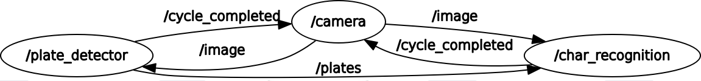

# Implementation of Vehicle Registration Plate Recognition using CNNs, my Bachelor Thesis.

##
In this project, that was my bachelor thesis, a two-stage system is implemented for detection and recognition of Persian plates in urban traffic cameras. 
For the **Plate Detection** phase, that includes finding the location of plates in each frame of the test video, the **Faster-RCNN** method is used that outputs detected plates' bounding boxes. 
Next level, Plate Recognition, that predicts Id of the detected plates and actually behaves as an OCR module, includes two sub-levels: 
First, image segmentation and some low-level image processing algorithms are used to find characters' contours in a given plate. Then, a deep convolutional neural network(SqueezeNet) with 22 classes is used to determine type of each character.

### Demo

<p align="center">
  Detection frequency 20-25HZ
</p>
<p align="center">
      
</p>

<br>
<br>
<p align="center">
  Recognition time per character = 0.002s, that reduces overall frequency of the system to 13-17 HZ.
  Actually frequency of recognition phase depends on the number of detected plates in a frame.
</p>
<p align="center">
      
</p>

### How to install
1. First install forked version of [py-faster-rcnn](https://github.com/mammadjv/py-faster-rcnn) that includes some changes in configurations and files.
2. [Install](http://caffe.berkeleyvision.org/install_apt.html) Caffe.
3. Install ROS(instructions can be found [here](http://wiki.ros.org/kinetic/Installation/Ubuntu)).
4. Download the code from this repository:
```
git clone https://github.com/mammadjv/vehicle-registration-plate-recognition.git
```
5. Download the pre-trained file on plates dataset from [here](https://drive.google.com/open?id=1reVNen-nH2G0KaQyC1WkTCn-XR1EgmpE).
6. Change model paths in /path/to/vehicle-registration-plate-recognition/src/plate_detector/scripts/plateDetector.py, in line 36.
7. Change model paths in /path/to/vehicle-registration-plate-recognition/src/char_recognition/scripts/charRecognition.py, in line 20.
8. Add your video path to /path/to/vehicle-registration-plate-recognition/src/camera/src/camera/camera.cpp, line 13.
9. Change your directory to /path/to/vehicle-registration-plate-recognition and then enter:
```
catkin_make
```

### Why to use ROS?
  It enables us to use different programming languages(In addition to other benefits). For example, to implement low-level image processing methods, we can use faster languages like **C++** compared to **Python**.  <br>
Here we can see the relations graph between nodes in our system.
<p align="center">
      
</p>

### How to run

##
Open two terminal tabs(or use tmux 😜).

In the first tab:
```
./launch.sh
```
and just wait till all initializations are over(takes 20 seconds or so).

Then in the second tab enter:
```
./start_cycle.sh
```


**Here you go!**

